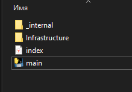

# Cборка для Windows
```
python -m PyInstaller --hidden-import "dependency_injector.errors" --hidden-import "dependency_injector.wiring" --hidden-import win32api main.py
```

## Структура для запуска файла exe
